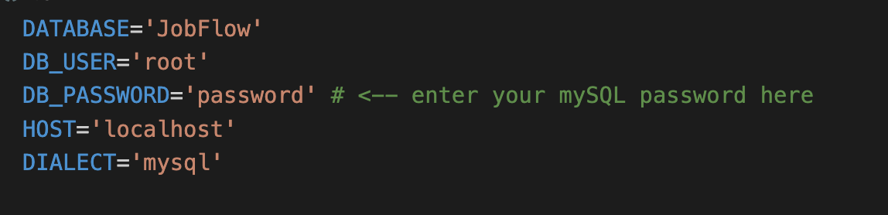

#  JobFlow : A web application to revolutionize the job search process

JobFlow is an innovative web application that aims to revolutionize the job search process by providing a comprehensive and user-friendly platform for job seekers. The project was undertaken with the primary objective of simplifying the job application process and helping individuals stay organized and efficient throughout their job search journey. 

When users sign up to JobFlow, they are able to access a Job Application Tracker in order to manage their job applications. They can add details to the table, as well as update and delete them. 

The project comprises a frontend which is built with React and a backend built with Node.js, Express and Firebase. The API connects to a mySQL database (via Sequelize) and it performs CRUD operations on the database. JobFlow also offers an integrated Job Search page, which allows users to search for jobs via an external [JSearch API](https://rapidapi.com/letscrape-6bRBa3QguO5/api/jsearch/details).


## Technologies Used:

- React
- Node.js
- Express (API)
- mySQL (database)
- Sequelize (ORM)
- Clever Cloud (database hosting service)
- Postman
- Firebase (external API for user management and authentication)
- Jest (testing)
- JSearch API (external API)

# Getting Started

## Please note
This project requires node version 16.4 or later.

## Prerequsities
1. Download mySQl on your machine https://www.mysql.com/downloads/
2. Create a new database called 'JobFlow' by using the command 'CREATE DATABASE JobFlow'

## To run the application

1. **Open your Code Editor**, create a local copy of the project from GitHub repository: https://github.com/irina-sheveliova/CFG-Job-tracker.git  

2. **Navigate to the api folder:**   
- Open a terminal and type: `cd api`
- Download dependencies for api folder: `npm install`
- In the `.env` file please enter your mySQL password and ensure the connection details are correct when using local host.  
  

- In the .env file you will see that there is also an optional config for running the database using a cloud service provided by Clever Cloud.

- Run the backend: `npm start`
- As a result you should see a message in your terminal "Server is running on port 8080". This means the api is running on `http://localhost:8080`.


3. **Navigate to the client folder:**  
- Open a second terminal and type: `cd client`
- Download dependencies for client folder: `npm install`
- Run the client: `npm start`
- As a result you should see a message in your terminal "Compiled successfully!" and JobFlow Homepage should launch in your browser.

The application should now be available on `http://localhost:3000`, but please check the output of the `npm start` command to be sure.


## To run tests
Please run the backend unit tests locally, with local host. 
To run tests in the respective api and client folders, you can enter the command:

```bash
npm test
```

Launches the test runner in the interactive watch mode.\
See the section about [running tests](https://facebook.github.io/create-react-app/docs/running-tests) for more information.

