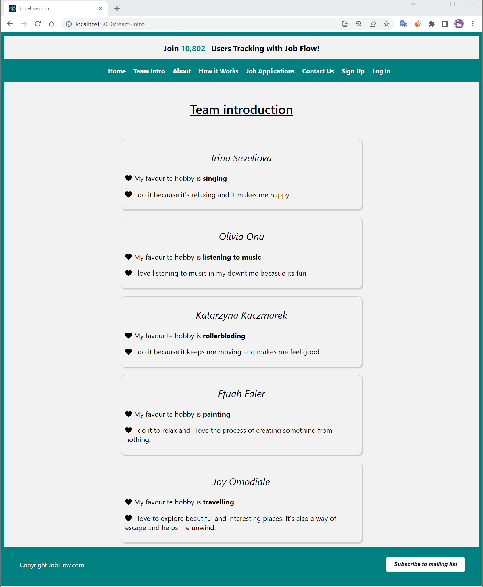
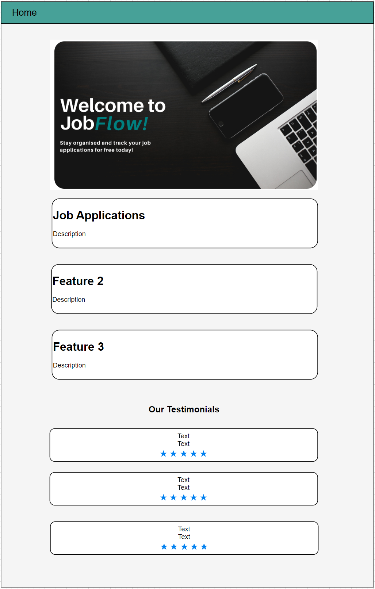
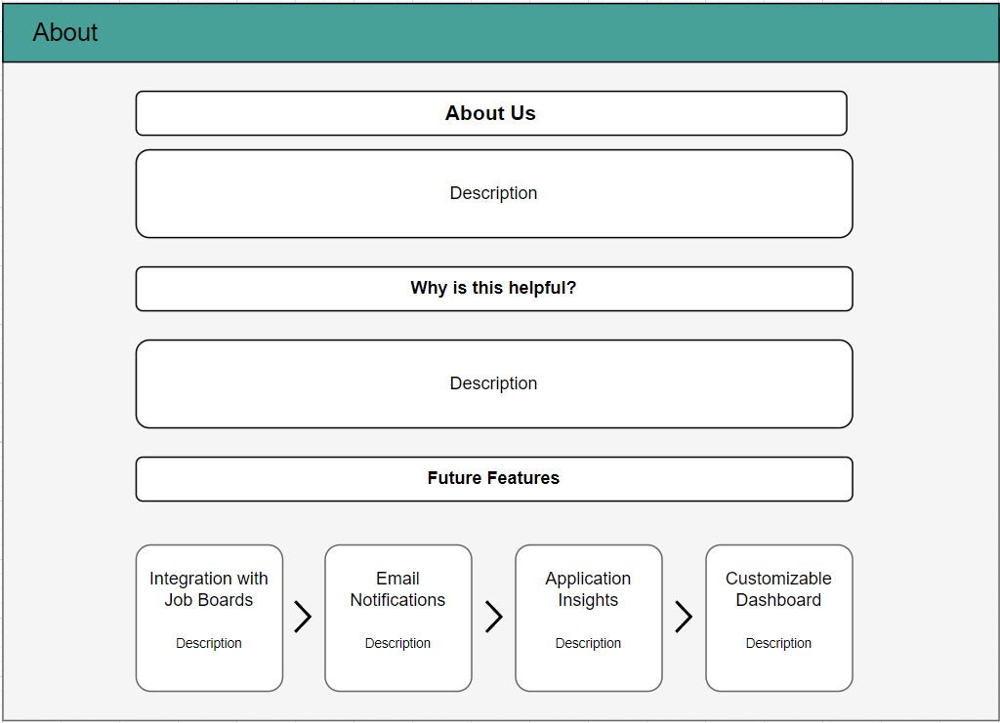
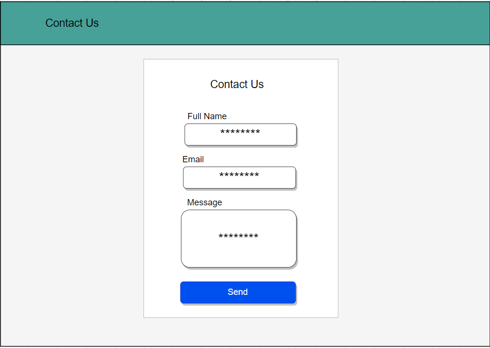
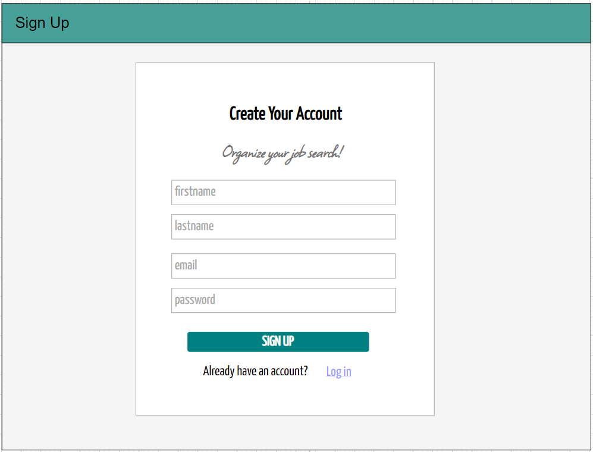
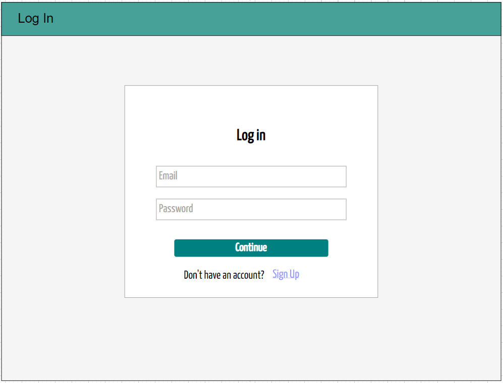
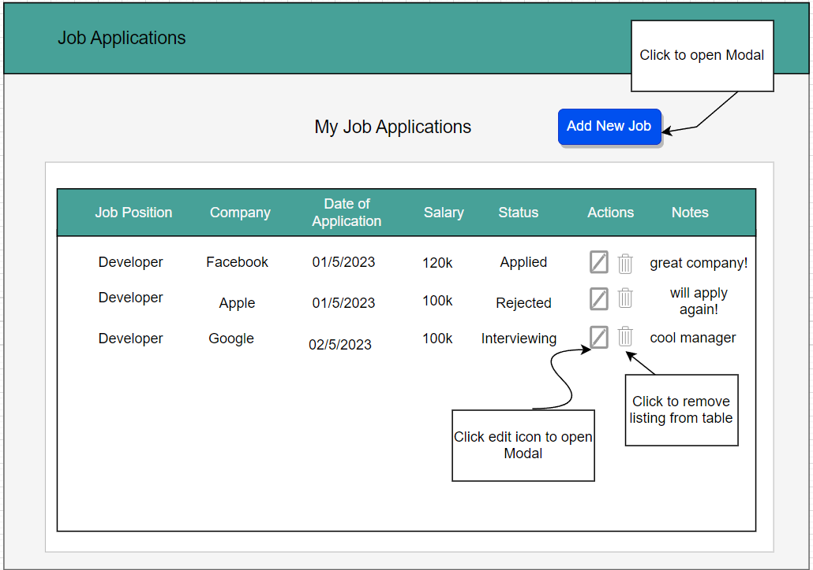
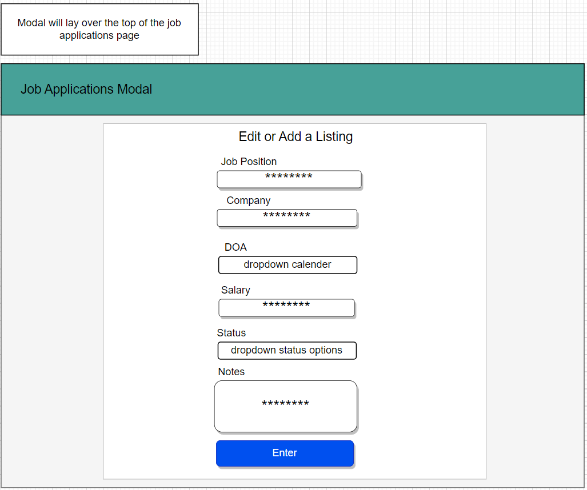
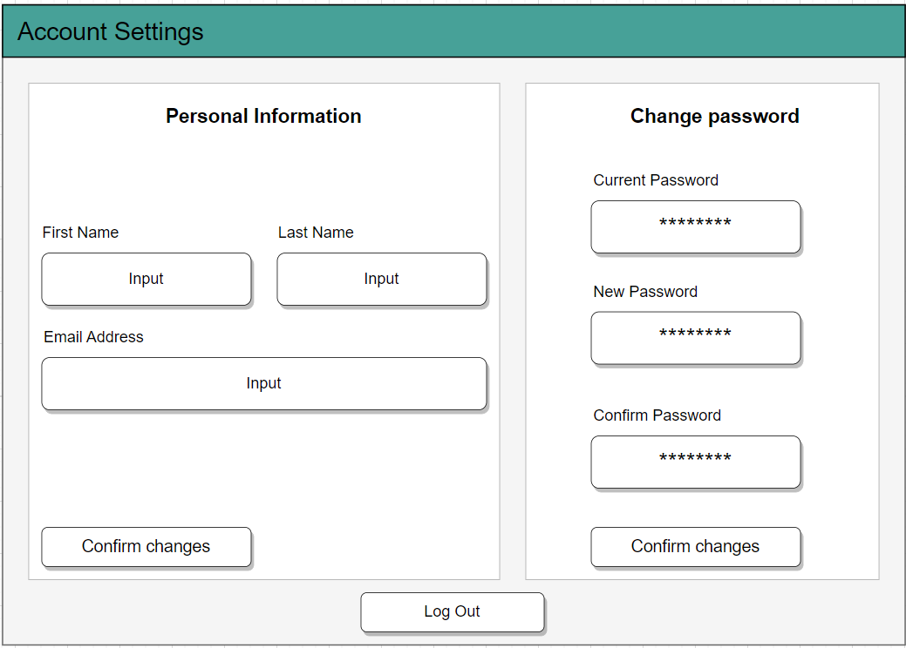

# HOMEWORK WEEK 2  

## Part 1  

### What is the idea/what are you building?
Our team is working on a website called Job Flow that helps job seekers manage their job search process in one place. With features like job search, job application tracking, interview scheduling, and resume management, the website aims to streamline the hiring process for recruiters and reduce the stress and anxiety associated with the job search process for job seekers.

### Who is your target audience? Who will this benefit?
Job Flow is a revolutionary platform designed to assist job seekers in navigating the challenging process of job hunting. Our target audience is vast and inclusive, as we believe everyone deserves access to a tool that makes their job search easier. Job Flow aims to support job seekers of all ages and backgrounds, whether they are just entering the workforce or looking to change their career path. The platform is suitable for full-time or part-time job seekers, freelancers, or those seeking internships. Our goal is to provide job seekers with a centralized platform to organize and manage their job search process efficiently. This includes tracking job applications, scheduling interviews, and following up with potential employers.

Job hunting can be an overwhelming process, and Job Flow is here to help. Our platform is designed to make the job search process more accessible and manageable for everyone. We understand the challenges that job seekers face in today's competitive job market. Therefore, we have created a user-friendly platform that helps job seekers to stay organized and informed. By reducing the stress and anxiety associated with the job search process, Job Flow helps job seekers find the right job for them.

Overall, our platform is intended to benefit job seekers from all walks of life. We believe that everyone deserves the opportunity to find a job that suits their skills and interests, and we are here to help make that process easier.

### How will you work? What tools will be used?

In order to work efficiently, our team will adopt an agile methodology approach. This approach emphasizes collaboration, flexibility, and quick feedback loops to deliver a high-quality product that meets the needs of our users. By breaking down the project into smaller, manageable pieces, we can adjust our development process as needed to accommodate any changes or unforeseen challenges that may arise.

To build our website, we will be using React as our frontend technology. React is an open-source JavaScript library that allows us to build dynamic, interactive user interfaces quickly and easily. With React, we can create reusable components that can be used across the website, making our development process faster and more efficient.

On the backend, we will be using Node.js, a popular runtime environment that allows us to execute server-side JavaScript. Node.js is well-suited for building scalable, high-performance web applications and has a vast library of modules and tools that we can use to speed up development.

We have selected MS SQL as our database technology because of its reliability, scalability, and strong community support. With MS SQL, we can create complex queries and manage large datasets efficiently, making it an excellent choice for our job tracking website.

To organize our workload, we will be using GitHub and Jira as our primary task management tools. GitHub will allow us to collaborate on code, track changes, and review each other's work. Jira will enable us to create and manage tasks, assign them to team members, and track progress over time.

To ensure that everyone on the team is working on tasks that match their skills and expertise, we will assign tasks based on each team member's strengths and knowledge. This approach will allow us to work efficiently and effectively and will help us deliver a high-quality product that meets our users' needs.

Finally, we will hold weekly meetings to discuss project progress, address any challenges, and ensure that everyone is aligned on goals. These meetings will enable us to stay on track and ensure that we are meeting our milestones and deadlines. We will also have periodic check-ins and communication channels on Slack to facilitate collaboration and keep everyone updated on any changes or updates.

### What are the key features of your project?
Job Flow's website features a navigation bar that provides easy access to the website's main pages. The Home page provides an overview of the platform, while the About page provides information about the product and its features. The Job Applications page is the central hub for managing job applications, allowing users to easily add new job applications and track progress in one location.

The How It Works page provides step-by-step instructions on how to use the website's features, especially for new users who are unfamiliar with the platform. The Sign Up and Login pages ensure the security and privacy of user information, as well as enabling users to take full advantage of the platform's capabilities. Job Flow prioritizes user experience, security, and organization, aiming to help job seekers find their next job more efficiently and effectively.  

## Part 2  

### Design wireframe
JobFlow website will have approximately 8 pages, the prototype has been created using modern tool 'drawio'. Detailed diagram is available by the link https://app.diagrams.net/?src=about#Hirina-sheveliova%2FCFG-Job-tracker%2Fproject_hw%2FProject_Homework%2FCFG%20JobFlow%20Diagram.drawio, as well as attached to GitHub repo as .pdf file "CFG JobFlow Diagram.pdf"

**The flow** is easy and self-explanatory - user opens home page, then he may switch between tabs using Navigation pane to read more about application on "About" and "How It Works" pages. He can create an account by clicking "Sign Up" button or log in to existing account using "Log In" button. Once logged in user will see the list of job applications he already created and can also create a new entry using "Add New Job" button. He can also switch to Account Settings page where it's possible to update profile details, change password and log off using "Log Out" button.

Our team aimed to design a **colour palette** that aligned with our users' preferences and embodied our platform's values. After careful consideration, we selected teal as the primary colour since it conveys balance, peace, and trust, all of which are crucial for job seekers. Our platform strives to provide a sense of calm and stability during the stressful job search process.  

In addition, we integrated white into our colour scheme, as it symbolizes purity, clarity, and simplicity. We designed our platform to be organized and streamlined, simplifying the job search process for our users. White's clean and modern look improves the user experience and facilitates readability.  

Lastly, we decided on black for our text and other essential website elements to increase contrast and enhance legibility. Black is a bold colour that contributes sophistication and elegance to the overall design.
Overall, our colour choices were carefully made to produce a visually appealing and functional website that meets the needs of our users. The combination of teal, white, and black creates a harmonious and aesthetically pleasing colour palette that is professional and user-friendly. We believe that our website's colours reflect our platform's values and contribute to a positive user experience. 

## Part 3  

### Team introduction
As we are quite far ahead with our front-end part, we created a separate page "Team Intro" for this task, it's available from navigation pane or by the link ``/team-intro``  

  

To run the application:
1. Create a local copy of the project from GitHub repository
2. In terminal navigate to 'client' folder:  
``cd client``
3. Download node modules:  
``npm install``
4. Run the application:  
``npm start``  

## Addendum (Application wireframes)  

   

   

   

   

   

   

   

   

  